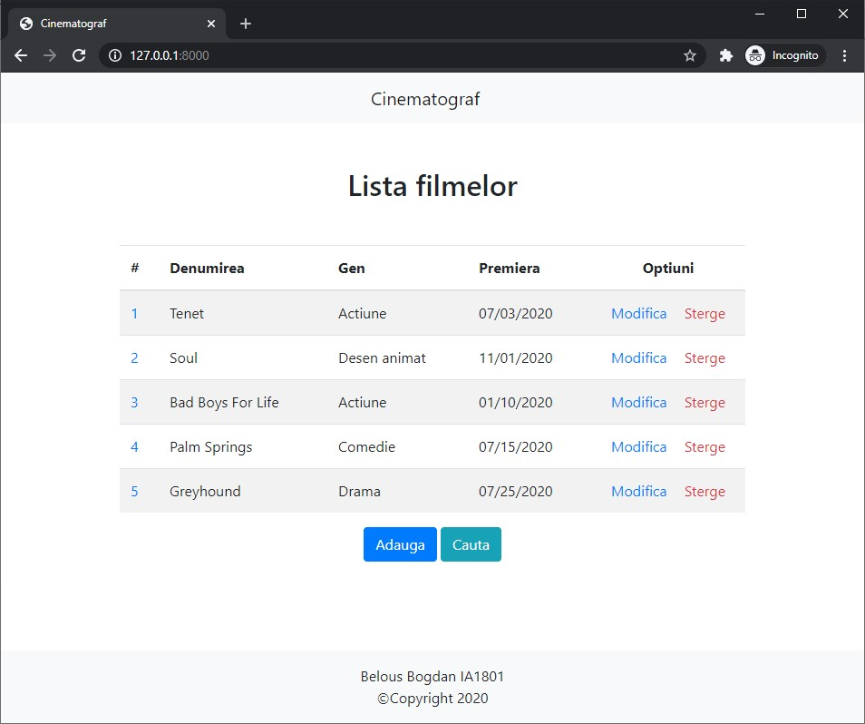

# Symfony
## Install

```shell
# clone the repo
git clone https://github.com/bogdanbelous/USM-Symfony.git

# change into the repo directory
cd USM-Symfony/Lucrul_Individual

# install dependencies
composer install

# run
symfony server:start
```

## Result
